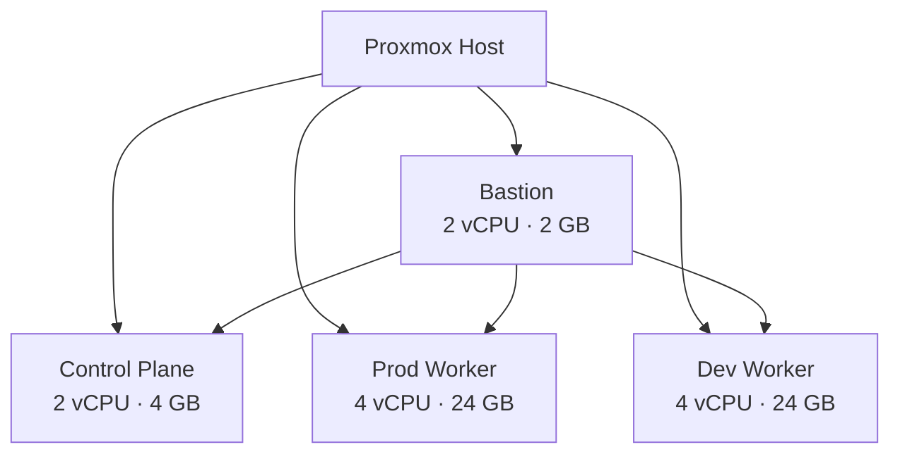
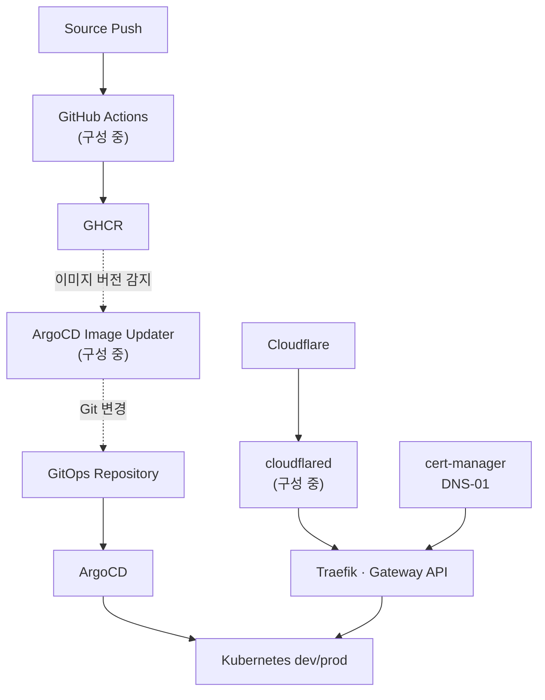

# Kubernetes 기반 Dev/Prod GitOps Platform
실무에서 경험한 **변경 검증, 운영 자동화, 장애 분석 방식**을 Kubernetes 환경으로 확장하기 위해 구축하고 있는 홈랩 프로젝트입니다.

기존에는 팀 토이프로젝트의 Spring Boot 애플리케이션을 AWS에 배포하는 방식을 고려했습니다. 그러나 Free Tier의 사용 범위가 제한적이고, 프로젝트를 장기간 운영할수록 클라우드 비용이 부담될 수 있다고 판단했습니다. 이에 개인 홈 서버를 기반으로 인프라 구성부터 애플리케이션 배포, 모니터링, 운영 자동화까지 직접 다룰 수 있는 환경을 만들고 있습니다.

이 홈랩은 단순한 테스트 서버가 아니라, 팀원들과 개발하는 애플리케이션을 안정적으로 배포하고 운영하기 위한 기반 환경입니다. 개발 변경 사항을 dev 환경에서 먼저 검증한 뒤 prod에 반영할 수 있도록 환경과 배포 정책을 분리하고, 향후 MSA 구조와 추가 서비스 배포까지 수용할 수 있는 플랫폼을 목표로 합니다.

> 이 프로젝트는 개인 환경에서 진행한 학습·구축 프로젝트입니다. Kubernetes 운영 실무 경험으로 과장하지 않으며, 실제 업무에서 쌓은 플랫폼 운영 경험을 Cloud Native 환경으로 확장하는 과정에 초점을 두고 있습니다.

---

## 프로젝트 목표

- Terraform과 Ansible을 이용해 인프라 및 클러스터 구성을 재현 가능하게 관리
- ArgoCD를 기준으로 플랫폼과 애플리케이션의 배포 상태를 Git에 선언
- dev와 prod의 배포 권한, 대상 Namespace, 동기화 정책 분리
- SOPS와 age를 이용해 Secret을 암호화한 상태로 Git에서 관리
- Gateway API, cert-manager, Cloudflare Tunnel을 이용해 안전한 외부 진입 경로 구성
- 이미지 빌드부터 배포까지 이어지는 CI/CD와 GitOps 흐름 구성
- 로그·메트릭·배포 이력을 연결해 장애 원인을 확인할 수 있는 관측 환경 구성
- 구현 과정과 장애 해결 내역을 GitHub Project와 Issue에 기록

---

## 현재 진행 상태

`2026-07-30 기준`

| 구분 | 상태 | 구현 범위 |
| --- | --- | --- |
| 가상화 인프라 | 완료 | Proxmox 기반 Bastion, Control Plane, dev/prod Worker VM 구성 |
| 서버 구성 자동화 | 완료 | Ansible 기반 OS 초기 설정, SSH, Tailscale 및 Kubernetes 설치 절차 구성 |
| Kubernetes 클러스터 | 완료 | Kubespray 기반 클러스터 설치와 Worker 역할 분리 |
| ArgoCD Bootstrap | 완료 | Helm 설치, Private Repository 인증, Root Application 구성 |
| GitOps 권한 분리 | 완료 | `platform`, `databases`, `apps-dev`, `apps-prod` AppProject 분리 |
| 공통 진입 경로 | 검증 중 | Traefik, Gateway API, cert-manager, HTTPRoute 구성 |
| Secret 관리 | 검증 중 | SOPS·age와 KSOPS를 이용한 암호화 및 ArgoCD 복호화 |
| 외부 접근 | 구성 중 | Cloudflare Tunnel을 통한 인바운드 포트 비개방 구조 |
| 애플리케이션 배포 | 구성 중 | GitHub Actions, GHCR, ArgoCD Image Updater 연계 |
| Observability | 예정 | Prometheus, Grafana, Loki 기반 메트릭·로그 수집 |

완료 여부는 리소스가 생성된 시점이 아니라, **재배포 가능 여부와 기능 검증 기준을 통과한 시점**을 기준으로 판단합니다.

---

## Architecture

### Physical Host

| 구분 | 사양 |
| --- | --- |
| 모델 | Intel NUC 12 Pro Kit (`NUC12WSKi7`) |
| CPU | Intel Core i7-1260P, 12 Core(P-Core 4 + E-Core 8) / 16 Thread |
| 메모리 | Samsung DDR4-3200 32 GB × 2, 총 64 GB |
| 스토리지 | WD Blue SN550 NVMe 1 TB |
| 확장 슬롯 | M.2 2280 NVMe × 1, M.2 2242 × 1 |
| 네트워크 | Intel i225 2.5 GbE, Wi-Fi 6E |
| 소비 전력 | Idle 약 8–12 W, 부하 시 약 40–50 W |

저전력 소형 서버를 사용해 24시간 운영 시의 전력 부담을 낮추면서도, Control Plane과 dev/prod Workload를 역할별 VM로 분리할 수 있도록 구성했습니다.

### 인프라 구성



| 노드 | 역할 | 사양 | 운영 기준 |
| --- | --- | --- | --- |
| `infra-bastion` | Terraform·Ansible 실행 및 관리 진입점 | 2 vCPU / 2 GB / 20 GB | 클러스터 외부 관리 |
| `k8s-master` | Kubernetes Control Plane | 2 vCPU / 4 GB / 40 GB | 일반 Workload 미배치 |
| `k8s-worker-prod` | prod Workload | 4 vCPU / 24 GB / 200 GB | prod 전용 Taint·Label |
| `k8s-worker-dev` | dev Workload | 4 vCPU / 24 GB / 150 GB | dev 전용 Taint·Label |

### VM 분리 기준

#### `infra-bastion`

홈랩의 관리 진입점입니다. 각 VM의 관리 포트를 외부에 직접 노출하지 않고 Bastion을 기준으로 인프라 구성과 SSH 접근을 수행합니다.

- SSH Jump Host
- Terraform과 Ansible 실행
- Kubespray 기반 Kubernetes 설치
- Tailscale을 통한 원격 관리 접근
- 향후 운영 스크립트와 백업 작업 실행

#### `k8s-master`

Kubernetes Control Plane 전용 노드입니다. `kube-apiserver`, `etcd`, `kube-controller-manager`, `kube-scheduler`가 실행되므로 일반 Worker Workload와 분리해 관리 영역의 자원 경합을 줄입니다.

#### `k8s-worker-prod`

운영 Workload를 우선 배치하는 노드입니다. Spring Boot 운영 애플리케이션과 prod PostgreSQL, 안정성이 필요한 일부 플랫폼 리소스를 대상으로 합니다. `pool=prod` Label과 Taint를 적용해 의도하지 않은 dev Workload가 배치되지 않도록 구성합니다.

#### `k8s-worker-dev`

개발 및 테스트 Workload를 우선 배치하는 노드입니다. dev 애플리케이션과 dev PostgreSQL, PR Preview, 실험적인 플랫폼 리소스를 대상으로 하며, 운영 배포 전에 변경 사항을 검증하는 환경으로 사용합니다.

---

### GitOps 및 외부 요청 흐름



점선으로 표시된 구간은 현재 구성 또는 검증 중인 흐름입니다.

---

## 기술 구성

| 영역 | 기술 | 적용 목적 |
| --- | --- | --- |
| Virtualization | Proxmox | 물리 서버 위에 역할별 VM 구성 |
| IaC | Terraform | VM과 인프라 구성을 코드로 관리 |
| Configuration | Ansible | OS 초기 설정과 클러스터 설치 절차 자동화 |
| Kubernetes | Kubespray, Kubernetes | Control Plane과 dev/prod Worker 구성 |
| GitOps | ArgoCD, Helm | 선언적 배포와 클러스터 상태 동기화 |
| Secret | SOPS, age, KSOPS | Git에 저장되는 Secret 암호화 및 배포 시 복호화 |
| Network | Traefik, Gateway API | 공통 진입점과 Route 관리 |
| TLS | cert-manager, Cloudflare DNS-01 | 인증서 발급 및 갱신 자동화 |
| External Access | Cloudflare Tunnel | 공유기 인바운드 포트 비개방 |
| CI/CD | GitHub Actions, GHCR, ArgoCD Image Updater | 이미지 빌드·저장·배포 자동화 |
| Observability | Prometheus, Grafana, Loki | 메트릭·로그 기반 상태 확인 |

---

## 주요 설계 결정

### 1. Bootstrap과 GitOps 관리 범위 분리

ArgoCD가 존재하지 않는 최초 설치 단계는 Ansible이 담당하고, ArgoCD가 기동된 이후의 플랫폼 리소스는 GitOps로 관리합니다.

```
Ansible
└─ Helm CLI 및 ArgoCD 최초 설치
   └─ Root Application 적용
      └─ 이후 플랫폼 리소스는 ArgoCD가 Git 기준으로 관리
```

이 경계를 둔 이유는 ArgoCD가 자신을 설치할 수 없는 초기 의존성을 해결하면서도, 설치 이후에는 수동 변경을 최소화하기 위해서입니다.

### 2. Root Application 기반 App-of-Apps 구성

Root Application은 하위 Application을 직접 배포하는 진입점입니다. 관리자는 클러스터에 여러 Application을 개별 적용하지 않고, Root Application이 참조하는 Git 경로를 변경합니다.

- Application 정의와 Helm Values를 Git에서 관리
- 공통 플랫폼과 환경별 애플리케이션의 배포 경로 분리
- Sync Wave를 이용해 CRD, Controller, 사용자 리소스의 적용 순서 제어
- Git 변경 이력으로 배포 구성과 변경 사유 추적

### 3. AppProject로 배포 권한 분리

`default` Project에 모든 권한을 부여하지 않고, 리소스 성격과 대상 환경에 따라 Project를 나눴습니다.

| AppProject | 대상 | 권한 기준 |
| --- | --- | --- |
| `platform` | cert-manager, Traefik, Gateway, Monitoring 등 | CRD·ClusterRole 등 Cluster-scoped 리소스 허용 |
| `databases` | PostgreSQL, MinIO 등 데이터 서비스 | 지정된 Repository와 Namespace만 허용 |
| `apps-dev` | 개발 애플리케이션 | dev Namespace만 배포 가능 |
| `apps-prod` | 운영 애플리케이션 | prod Namespace만 배포 가능 |

허용되지 않은 Repository나 Namespace를 지정했을 때 Application이 `InvalidSpecError`로 차단되는지 확인해 권한 경계를 검증합니다.

### 4. dev/prod 배포 정책 분리

개발 환경은 빠른 검증을 위해 자동화를 우선하고, 운영 환경은 명시적인 검토 기록을 남기는 방향으로 설계했습니다.

| 항목 | dev | prod |
| --- | --- | --- |
| 기준 브랜치 | `develop` | `main` 및 Release Tag |
| 이미지 태그 | `sha-<commit>` | `v<major>.<minor>.<patch>` |
| 이미지 식별 | 태그와 Digest 기록 | 변경하지 않는 Release Tag와 Digest 사용 |
| GitOps 반영 | Image Updater 자동 반영 | Git 변경 PR 검토 후 반영 |
| ArgoCD Sync | 자동 Sync·Self Heal | 승인 후 Sync |
| Prune | 활성화 | 초기에는 비활성화 후 영향 검증 |
| Rollback | 이전 Git Revision으로 복구 | 승인된 이전 Release Revision으로 복구 |

`latest`와 같은 Mutable Tag는 배포 시점의 이미지를 정확히 추적하기 어렵기 때문에 사용하지 않습니다.

### 5. SOPS 기반 Secret 관리

Secret 원문을 Git에 저장하지 않기 위해 SOPS와 age를 사용합니다.

- 저장소에는 `.sops.yaml` 암호문만 Commit
- age Private Key는 Bootstrap 단계에서 ArgoCD Namespace에 별도 주입
- ArgoCD repo-server의 KSOPS Plugin이 Sync 시점에 복호화
- Secret이 필요한 Controller보다 먼저 생성되도록 의존성과 Sync 순서 관리
- Private Key와 복호화된 Secret은 README, Issue, 로그에 기록하지 않음

### 6. Gateway API와 Cloudflare Tunnel

애플리케이션 Route를 공통 진입점과 분리하기 위해 Gateway API를 사용합니다. 외부 요청은 공유기의 인바운드 포트를 개방하지 않고 Cloudflare Tunnel을 통해 Traefik Service로 전달하는 구조를 구성하고 있습니다.

- `Gateway`: Listener와 인증서 등 공통 진입 정책
- `HTTPRoute`: 서비스별 Hostname과 Backend 연결
- `cert-manager`: Cloudflare DNS-01을 이용한 인증서 발급
- `cloudflared`: 외부 요청을 Kubernetes 내부 Traefik으로 전달
- Cloudflare WAF: 한국 외 지역 접근 제한 예정
- Cloudflare Access: ArgoCD·Grafana 등 관리 화면의 사용자 인증 예정

## 배포 흐름

### dev

1. `develop` 브랜치에 변경 사항을 Push합니다.
2. GitHub Actions가 테스트와 빌드를 수행합니다.
3. `ghcr.io/<owner>/<project>:sha-<commit>` 형식으로 이미지를 저장합니다.
4. ArgoCD Image Updater가 새 이미지 버전을 확인해 GitOps Repository를 변경합니다.
5. ArgoCD가 변경된 Revision을 감지하고 dev 환경에 자동 Sync합니다.
6. Pod 상태, Probe, HTTP 응답과 배포 이미지를 확인합니다.

### prod

1. 검증된 변경을 `main`에 Merge하고 Release Tag를 생성합니다.
2. GitHub Actions가 동일한 소스 기준으로 운영 이미지를 빌드합니다.
3. GitOps Repository 변경 PR에서 이미지 Tag와 Digest를 검토합니다.
4. PR 승인 후 ArgoCD가 운영 환경에 변경을 반영합니다.
5. 배포 후 상태와 핵심 기능을 확인하고, 실패하면 이전 Git Revision으로 복구합니다.

> 위 배포 흐름 중 GitHub Actions, GHCR, ArgoCD Image Updater 연계는 현재 구성 중입니다.
> 

---

## 검증 기준

구성 요소가 설치되었다는 사실보다 다음 질문에 답할 수 있는지를 기준으로 검증합니다.

### Infrastructure

- Terraform Plan에서 예상하지 않은 VM 변경이 없는가
- Ansible Playbook을 다시 실행해도 동일한 결과를 유지하는가
- 각 노드의 Label·Taint와 Workload 배치가 설계와 일치하는가

### GitOps

- ArgoCD Application의 `Sync`와 `Health` 상태가 정상인가
- Git의 선언 상태와 클러스터의 실제 상태가 다른 경우 Drift를 탐지하는가
- 허용되지 않은 Repository·Namespace·Cluster Resource를 AppProject가 차단하는가
- CRD와 Controller, 사용자 리소스가 올바른 순서로 적용되는가

### Network and TLS

- `CertificateRequest → Order → Challenge → Certificate` 상태를 순서대로 확인할 수 있는가
- DNS-01 Challenge가 정상적으로 제출되고 Certificate가 `Ready=True`가 되는가
- 외부 요청이 Cloudflare Tunnel, Traefik, HTTPRoute, Service, Pod 순서로 전달되는가
- 관리용 Endpoint가 일반 사용자에게 노출되지 않는가

### Deployment

- Commit SHA와 실행 중인 이미지 Tag·Digest를 연결할 수 있는가
- readinessProbe가 실패한 Pod가 트래픽을 받지 않는가
- 실패한 배포를 이전 Git Revision으로 복구할 수 있는가
- dev의 자동 배포가 prod로 직접 이어지지 않는가

---

## Troubleshooting

### cert-manager DNS-01 Challenge가 Pending 상태에 머문 문제

**현상**

Wildcard Certificate가 `Ready=True`로 전환되지 않고 Challenge가 `Pending` 상태에 머물렀습니다.

```
error getting cloudflare secret:
secrets "cloudflare-api-token" not found
```

**확인**

1. `CertificateRequest`, `Order`, `Challenge` 순서로 상태를 확인했습니다.
2. Challenge Controller가 참조하는 Namespace에 `cloudflare-api-token` Secret이 없는 것을 확인했습니다.
3. 저장소에는 SOPS 암호화 파일이 있었지만, 파일 존재만으로 Kubernetes Secret이 생성되는 것은 아니라는 점을 확인했습니다.
4. ArgoCD Application 경로, KSOPS 복호화 설정, Secret의 대상 Namespace와 Sync 순서를 점검했습니다.

**개선 방향**

- Secret이 실제로 생성되는 Application 경로와 Namespace 일치 여부 검증
- cert-manager가 참조하는 `secretKeyRef`와 Secret Key 이름 확인
- Controller 배포 전에 Secret이 준비되도록 Sync 순서 조정
- 인증서 검증 Runbook에 Secret 의존성 확인 절차 추가

**완료 기준**

- Secret 생성 확인
- Challenge의 `presented=true` 확인
- Certificate의 `Ready=true` 확인
- HTTPS 요청 정상 응답 확인

이 사례는 최종 검증이 끝난 뒤 실제 조치 결과와 관련 Issue 링크를 추가할 예정입니다.

### ArgoCD Private Repository 인증 실패

**현상**

Root Application Sync 과정에서 Private Git Repository의 Reference를 가져오지 못하고 인증 오류가 발생했습니다.

**원인 분석**

- ArgoCD Application이 Git을 로컬에 미리 Clone해서 사용하는 구조가 아니라, repo-server가 Sync 시점에 원격 Repository를 조회한다는 점을 기준으로 접근했습니다.
- Root Application보다 Repository Credential이 먼저 준비되어야 한다는 Bootstrap 의존성을 확인했습니다.
- Git 계정 비밀번호가 아닌 PAT 기반 인증이 필요하며, Repository URL과 Credential Scope가 일치해야 한다는 점을 확인했습니다.

**조치**

- PAT를 SOPS 암호화 대상에 포함
- Bootstrap 단계에서 Repository Credential을 먼저 주입
- Credential 확인 이후 Root Application을 적용하도록 순서 분리

**검증**

- Repository Connection 상태 확인
- Root Application Manifest 렌더링 확인
- 하위 Application 생성 및 Sync 상태 확인

### AppProject 권한으로 잘못된 배포 대상 차단

**검증 목적**

Application이 실수로 다른 환경의 Namespace나 허용되지 않은 Repository를 사용할 때 배포가 차단되는지 확인했습니다.

**검증 항목**

- `apps-dev` Application이 prod Namespace를 대상으로 지정할 때 차단
- `apps-prod` Application이 dev Namespace를 대상으로 지정할 때 차단
- 허용 목록에 없는 Helm·Git Repository 사용 차단
- Namespaced Application에서 Cluster-scoped 리소스 생성 차단

**결과**

Application이 `InvalidSpecError` 상태로 전환되는 것을 기준으로 권한 경계를 확인했습니다. 이를 통해 Git 저장소에 잘못된 설정이 Merge되더라도 ArgoCD Project 수준에서 한 번 더 배포를 제한하도록 구성했습니다.

---

## Repository 관리 방식

작업은 GitHub Project에서 Feature와 Task로 나누어 관리합니다.

```
Feature
├─ 목표와 범위
├─ 설계 기준
└─ Task
   ├─ 구현 내용
   ├─ 검증 방법
   ├─ 완료 기준
   └─ 관련 Commit 또는 PR
```

Issue에는 단순 작업 목록뿐 아니라 다음 내용을 남기는 것을 원칙으로 합니다.

- 왜 필요한가
- 어떤 대안을 검토했는가
- 어떤 기준으로 방식을 선택했는가
- 실제로 무엇을 구현했는가
- 어떤 명령과 상태로 검증했는가
- 어떤 문제가 발생했고 어떻게 원인을 좁혔는가
- 남은 한계와 후속 작업은 무엇인가

---

### 대표 Feature·Issue

| 구분 | 내용 | 링크 |
| --- | --- | --- |
| Feature | 홈랩 구성 의도 및 설계 | https://github.com/hweyoung/homelab/issues/4 |
| Feature | ArgoCD Root Application과 AppProject 권한 설계 | https://github.com/hweyoung/homelab/issues/17 |
| Task | 민감정보 파일 sops + age 암호화 및 KSOPS 복호화 구성 | https://github.com/hweyoung/homelab/issues/115 |
| Feature | TLS 및 외부 진입 경로 구성 | https://github.com/hweyoung/homelab/issues/25 |
| Task | Cloudflare Tunnel 구성 | https://github.com/hweyoung/homelab/issues/145 |
| Feature | GitHub Actions·GHCR·ArgoCD Image Updater 배포 | https://github.com/hweyoung/homelab/issues/34 |
| Troubleshooting | cert-manager Secret 오류 분석 및 복구 | https://github.com/hweyoung/homelab/issues/127#issuecomment-5102434082 |
| Project | 전체 진행 현황 | https://github.com/users/hweyoung/projects/7/views/7 |

---

## 현재 구성의 한계와 추후 개선 계획

- 단일 Control Plane으로 구성되어 있어 Control Plane 고가용성을 검증하지 못했습니다.
- dev와 prod를 논리적으로 분리했지만 동일한 물리 서버를 사용하므로 실제 운영 수준의 장애 격리는 아닙니다.
- Kubernetes는 개인 프로젝트 경험이며, 대규모 트래픽과 다중 클러스터 운영을 검증하지 못했습니다.
- GitHub Actions·GHCR·ArgoCD Image Updater 기반 배포 흐름은 현재 구성 중입니다.
- Prometheus·Grafana·Loki 기반 Observability와 배포 알림은 후속 단계로 진행할 예정입니다.
- Cloudflare Access를 이용한 관리 화면 접근 제어와 WAF 정책은 외부 진입 경로 검증 후 적용할 예정입니다.

다음 단계에서는 기능 추가보다 **실패한 배포의 복구, Secret 의존성 검증, 메트릭·로그·배포 이력을 연결한 장애 분석**을 우선할 계획입니다.

---

## 배운 점

- GitOps는 배포 도구를 추가하는 것이 아니라, Git과 실제 환경의 차이를 지속적으로 확인하고 되돌릴 수 있게 만드는 운영 방식이라는 점
- 자동화된 Sync와 Prune은 편리하지만, 권한·환경·삭제 범위를 먼저 분리하지 않으면 위험할 수 있다는 점
- Kubernetes 장애는 Pod 로그만 보는 것이 아니라, Application, Controller, Custom Resource, Event와 의존 Secret을 순서대로 따라가야 한다는 점
- Secret 파일을 암호화해 Git에 저장하는 것과, 배포 시점에 올바른 Namespace에 Secret이 생성되는 것은 별개의 문제라는 점
- 운영 환경에서는 원인 규명과 함께 변경 전 검증, 복구 기준, 작업 결과를 남기는 과정이 중요하다는 점

---

### Contact

- GitHub: https://github.com/hweyoung
- Blog: okbear3.tistory.com
- Email: gnldud0516@gmail.com