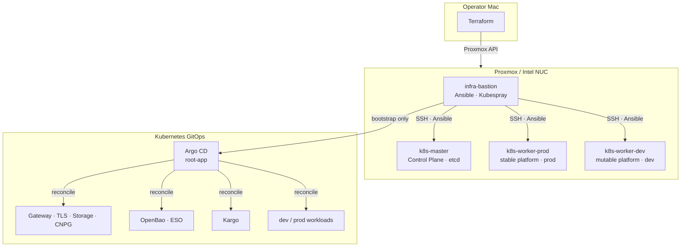
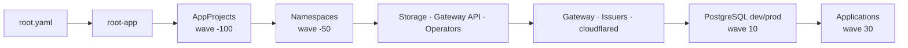
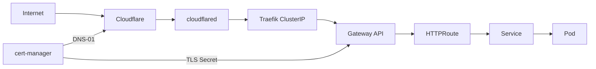
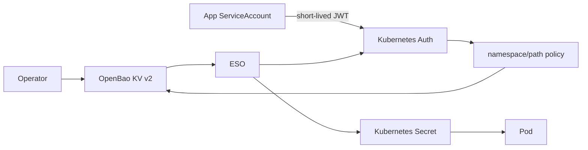
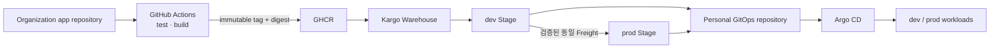

# Homelab Kubernetes GitOps Platform

Proxmox 위에 Kubernetes 클러스터를 구성하고, 인프라 생성부터 애플리케이션 배포까지의
소유권을 Terraform, Ansible/Kubespray, Argo CD로 분리한 홈랩 프로젝트입니다.

단순히 서비스를 설치하는 데서 끝나지 않고 다음 운영 질문에 답할 수 있는 환경을 목표로
합니다.

- 같은 인프라와 클러스터를 코드로 다시 만들 수 있는가?
- Git의 선언과 클러스터의 실제 상태가 다르면 이를 탐지하고 복구할 수 있는가?
- dev와 prod의 배치, 권한, 데이터가 서로 침범하지 않는가?
- Secret, 인증서, 외부 트래픽의 흐름을 끝까지 추적할 수 있는가?
- Kubernetes 업그레이드와 노드 장애 후 상태를 안전하게 복구할 수 있는가?

> 이 문서는 `2026-09-08` 현재 저장소에 선언된 구성을 기준으로 합니다.

## 현재 상태

| 영역 | 상태 | 저장소 기준 범위 |
| --- | --- | --- |
| Proxmox VM | 구성됨 | Bastion, 단일 Control Plane, dev/prod Worker |
| OS 및 네트워크 자동화 | 구성됨 | Rocky Linux, SSH, `/etc/hosts`, Tailscale |
| Kubernetes | 구성됨 | Kubespray 기반 설치, 노드 후처리, 기존 클러스터 순차 업그레이드 |
| Argo CD bootstrap | 구성됨 | Helm 설치, private repository 인증, root Application |
| GitOps 플랫폼 | 구성됨 | Namespace, StorageClass, Gateway API, cert-manager, Traefik, cloudflared, CNPG |
| Secret 플랫폼 | 연동 중 | OpenBao와 ESO 설치 선언, 애플리케이션 SecretStore/ExternalSecret 전환 필요 |
| Promotion | 구성 중 | Kargo controller 설치 선언, Stage/Warehouse/Promotion 정책은 후속 범위 |
| 데이터베이스 | 구성됨 | dev/prod CloudNativePG Cluster, `local-path` 영속 볼륨 |
| 애플리케이션 | 부분 구성 | test-nginx dev/prod, CommonPlant API dev |
| Observability | 예정 | Prometheus, Grafana, Loki, Alloy |

완료 여부는 리소스가 한 번 생성됐는지가 아니라 재실행, 상태 확인, 장애 복구 기준까지
검증됐는지를 기준으로 판단합니다.

## 전체 아키텍처



### 관리 영역의 소유권

```text
Mac
└── Terraform: Proxmox VM 수명주기
    └── infra-bastion
        ├── Ansible: OS, SSH, Tailscale, 운영 도구
        ├── Kubespray: Kubernetes 최초 설치
        └── Ansible: Argo CD와 root Application 최초 bootstrap
            └── Argo CD: Namespace, 플랫폼, DB, 애플리케이션의 최종 소유자
```

Terraform은 Mac에서 실행하고 Ansible/Kubespray는 `infra-bastion`을 실행 기준점으로
사용합니다. Argo CD가 기동된 뒤에는 플랫폼이나 애플리케이션 리소스를 Ansible로 중복
관리하지 않습니다.

## 도구 선택 이유

### Terraform — 인프라의 선언적 수명주기

Proxmox VM은 생성, 사양 변경, 삭제처럼 명확한 리소스 수명주기를 가지므로 Terraform이
담당합니다. Plan으로 변경 영향을 먼저 확인하고 VM 사양과 네트워크 구성을 코드로
재현할 수 있다는 점을 선택 기준으로 삼았습니다. Kubernetes 리소스까지 Terraform이
관리하게 하지는 않아 상태 파일의 영향 범위와 도구 간 소유권 충돌을 줄였습니다.

### Ansible과 Kubespray — 호스트 구성과 클러스터 bootstrap

SSH로 접근 가능한 서버의 패키지, 설정 파일, Tailscale, 운영 도구는 절차적이고 멱등적인
구성이 필요하므로 Ansible이 담당합니다. Kubernetes 자체는 직접 역할을 다시 작성하는
대신 검증된 Kubespray를 사용합니다. 신규 설치와 기존 클러스터 업그레이드는 별도
Playbook으로 분리했습니다. 업그레이드는 현재 버전과 목표 버전을 비교해 downgrade와 minor
건너뛰기를 차단하고, 사전·사후 health gate와 명시적 승인 후 `upgrade-cluster.yml`을
실행합니다. 작업 중 임시로 변경한 prod taint는 성공 여부와 관계없이 복원합니다.

### Argo CD — Kubernetes의 지속적 상태 조정

클러스터가 준비된 이후의 Namespace, Operator, 데이터베이스, 애플리케이션은 Git을
원본으로 지속적으로 reconcile해야 하므로 Argo CD가 담당합니다. App-of-Apps와 sync wave로
CRD와 Controller의 순서를 제어하고, AppProject로 dev/prod 및 cluster-scoped 권한을
제한합니다. UI와 Git 이력을 통해 변경과 drift를 함께 추적할 수 있다는 점도 선택 이유입니다.

## 물리 호스트와 노드

물리 호스트는 Intel NUC 12 Pro Kit(`NUC12WSKi7`), Core i7-1260P, 메모리 64GB,
NVMe 1TB 구성입니다. VM은 Rocky Linux cloud-init 템플릿에서 생성됩니다.

| 노드 | 역할 | 기본 사양 | Kubernetes 배치 기준 |
| --- | --- | --- | --- |
| `infra-bastion` | 관리 진입점, Ansible/Kubespray 실행 | 2 vCPU / 6GB / 40GB | 클러스터에 포함하지 않음 |
| `k8s-master` | Control Plane, etcd | 2 vCPU / 8GB / 80GB | 일반 workload 미배치 |
| `k8s-worker-prod` | prod 및 안정 플랫폼 | 4 vCPU / 24GB / 400GB | `pool=prod`, `platform-tier=stable` |
| `k8s-worker-dev` | dev 및 변경 가능 workload | 4 vCPU / 20GB / 300GB | `pool=dev`, `platform-tier=mutable` |

dev/prod는 별도 Worker와 Namespace, Label/Taint, AppProject로 논리적으로 격리합니다.
다만 하나의 물리 호스트와 단일 Control Plane을 공유하므로 물리 장애 격리나 고가용성을
제공하지는 않습니다.

## GitOps 구성

Argo CD의 진입점은 [`gitops/bootstrap/root.yaml`](gitops/bootstrap/root.yaml)입니다.
root Application은 `main` 브랜치의 root-app Helm chart를 읽어 자식 Application을
렌더링합니다.



| AppProject | 대상 | 권한 모델 |
| --- | --- | --- |
| `platform` | Operator, CRD, Gateway, Secret 플랫폼 | 필요한 cluster-scoped 리소스 허용 |
| `databases` | `postgres-dev`, `postgres-prod` | 지정 DB Namespace로 제한 |
| `apps-dev` | `api-*-dev` | dev Namespace와 허용된 리소스 종류로 제한 |
| `apps-prod` | `api-*-prod` | prod Namespace와 허용된 리소스 종류로 제한 |
| `argocd-system` | Argo CD HTTPRoute 등 | `argocd` Namespace로 제한 |

Namespace 메타데이터는 [`gitops/platform/namespaces`](gitops/platform/namespaces)가
소유합니다. root-app은 Namespace를 중복 정의하지 않고 Application 등록과 순서만
담당합니다.

## 네트워크와 외부 요청 흐름



- 공유기와 노드의 HTTP/HTTPS 인바운드 포트를 직접 공개하지 않습니다.
- `cloudflared`가 외부로 연결을 시작하고 Traefik ClusterIP로 요청을 전달합니다.
- Traefik은 Kubernetes Gateway provider만 사용하고 Gateway/HTTPRoute는 Git이 소유합니다.
- cert-manager는 Cloudflare DNS-01로 wildcard 인증서를 발급합니다.
- 관리용 접근은 Tailscale을 기본 경로로 사용합니다.

OpenBao의 HTTPRoute는 매니페스트만 존재하고 root-app 등록은 비활성화되어 있습니다.
초기화, unseal, 인증 정책 구성이 끝나기 전에 외부에서 초기화 API에 접근하지 못하게 하기
위한 의도입니다.

## Secret 설계

목표 흐름은 OpenBao를 Secret 원본 저장소로, ESO를 Kubernetes Secret 동기화 계층으로
사용하는 것입니다.



- `ClusterSecretStore` 대신 애플리케이션별 namespaced `SecretStore`를 사용합니다.
- OpenBao role은 ServiceAccount, Namespace, audience를 모두 제한합니다.
- policy는 각 애플리케이션 KV 경로의 읽기 권한만 부여합니다.
- 초기 root token과 unseal key는 Git과 Kubernetes Secret에 저장하지 않습니다.
- bootstrap 값과 전환 전 Secret은 SOPS/age/KSOPS로 유지합니다.
- 현재는 OpenBao와 ESO 설치 구성이 있으며 애플리케이션 SecretStore/ExternalSecret 전환은
  아직 저장소에 반영되지 않았습니다.

OpenBao는 prod Worker의 단일 Raft replica와 10Gi `local-path` PVC를 사용합니다. 자원
제약을 고려한 선택이지만 HA가 아니므로 외부 snapshot과 수동 unseal 절차가 필요합니다.

## 데이터와 애플리케이션

CloudNativePG Operator와 실제 PostgreSQL Cluster의 소유권을 분리합니다.

- `platform-cloudnative-pg`: CRD와 Operator
- `databases-postgres-dev`: dev Cluster와 CommonPlant DB role
- `databases-postgres-prod`: prod Cluster
- StorageClass: 단일 `local-path`
- PVC는 특정 Worker에 결합되므로 노드 손실 시 자동 복구를 보장하지 않음

| Application | Namespace | 용도 |
| --- | --- | --- |
| `apps-nginx-dev` | `api-nginx-dev` | Gateway와 dev 배치 검증 |
| `apps-nginx-prod` | `api-nginx-prod` | Gateway와 prod 배치 검증 |
| `apps-api-common-dev` | `api-common-dev` | CommonPlant Spring Boot dev workload |

### 이미지 빌드와 환경 승격

CommonPlant 애플리케이션은 팀이 관리하는 Organization 저장소에서 빌드하고, 홈랩의 배포
상태는 개인 GitOps 저장소에서 관리합니다. 애플리케이션 CI에 홈랩 저장소의 쓰기 권한을
넘기지 않으면서 동일한 이미지를 dev에서 검증한 뒤 prod로 승격하기 위해 Kargo를 경계에
둡니다.



빌드는 한 번만 수행하고 환경별로 다시 빌드하지 않습니다. 승격 단위는 mutable tag가 아니라
Freight가 가리키는 image digest이며, ConfigMap·Secret·DB endpoint·domain은 각 overlay에
남깁니다. 현재 변경은 Kargo controller 설치까지만 포함합니다. API/UI, 외부 webhook,
repository credential, Warehouse와 Stage는 인증 및 승인 정책과 함께 후속 변경으로
구성합니다.

## 선언된 버전

버전은 [`ansible/inventories/homelab/group_vars/all.yml`](ansible/inventories/homelab/group_vars/all.yml)과
[`gitops/clusters/homelab/root-app/values.yaml`](gitops/clusters/homelab/root-app/values.yaml)을
기준으로 정리했습니다.

### 인프라와 bootstrap

| 구성 요소 | 선언 버전 |
| --- | --- |
| Proxmox Terraform Provider | `telmate/proxmox 3.0.2-rc04` |
| Ansible | `11.13.0` |
| Kubespray | `v2.30.0` |
| Kubernetes | `v1.34.3` |
| Helm CLI | `v3.19.5` |
| Argo CD | app `3.4.6`, chart `10.2.2` |

### GitOps 플랫폼과 workload

| 구성 요소 | Chart/Image 버전 | 비고 |
| --- | --- | --- |
| cert-manager | chart `v1.21.1` | Kubernetes 1.34 지원, CRD 포함 |
| Traefik | app `3.6.15`, chart `39.0.9` | Gateway API 전용 |
| CloudNativePG | chart `0.29.0` | PostgreSQL Operator |
| OpenBao | chart `0.29.2`, image `2.6.2` | single Raft |
| External Secrets Operator | chart `2.9.0` | namespaced Store만 처리 |
| Kargo | chart `1.11.0` | API 비활성화 |
| cloudflared | image `2026.7.3` | 2 replicas |
| test-nginx | image `nginx:1.30.4-alpine` | dev/prod 검증 |
| platform-namespaces | local chart `0.1.0` | Namespace label 소유 |

Gateway API CRD와 local-path-provisioner는 현재 별도의 릴리스 버전이 명시되지 않았습니다.
재현성을 높이기 위해 immutable tag 또는 commit으로 고정하는 작업이 필요합니다.

## 디렉터리 구성

저장소의 최상위 디렉터리는 실행 도구가 아니라 **리소스의 수명주기와 최종 소유자**를
기준으로 나눴습니다. Terraform은 VM을 만들고, Ansible은 클러스터가 GitOps를 시작할 수
있는 상태까지 부트스트랩하며, 그 이후 Kubernetes 리소스는 Argo CD가 지속적으로
조정합니다. 아래 tree에는 전체 파일 대신 구조를 이해하는 데 필요한 핵심 경로만 표시합니다.

### `terraform/` — Proxmox 인프라 수명주기

```text
terraform/
├── provider.tf              # Proxmox 연결
├── variables.tf             # VM 입력값
├── main.tf                  # VM 정의
├── outputs.tf               # VM/IP 출력
└── terraform.tfvars.example # 입력 예시
```

Terraform 디렉터리는 Proxmox VM의 생성·변경·삭제만 소유합니다. OS 설정이나 Kubernetes
리소스를 함께 넣지 않아 Terraform state의 영향 범위를 가상 인프라로 한정하고, 생성된
호스트 정보를 다음 단계인 Ansible에 넘기는 경계로 사용합니다. 실제 `terraform.tfvars`와
state는 로컬 운영 데이터이므로 문서 구조와 Git 관리 대상에서 제외합니다.

### `ansible/` — 호스트 구성과 bootstrap 절차

```text
ansible/
├── Makefile                 # 운영 명령
├── inventories/homelab/     # 호스트와 변수
├── playbooks/               # 실행 순서와 정책
│   ├── bootstrap.yml        # 최초 구성
│   ├── upgrade.yml          # 기존 환경 변경
│   ├── bastion/             # 관리 노드
│   ├── network/             # 관리망
│   ├── kubernetes/          # 클러스터 lifecycle
│   └── platform/            # Helm·Argo CD
├── roles/                   # 재사용 작업
│   ├── kubespray/           # 클러스터 실행
│   ├── kubernetes/          # 상태 검증
│   └── argocd/              # GitOps bootstrap
├── scripts/                 # 실행 wrapper
└── docs/                    # 운영 runbook
```

#### Ansible 구성 전략

Ansible은 `infra-bastion`에서 실행되는 **절차의 소유자**입니다. `playbooks/`와 `roles/`를
분리한 이유는 실행 정책과 구현을 섞지 않기 위해서입니다. Playbook은 어느 호스트에서 어떤
순서와 승인 조건으로 실행할지를 결정하고, Role은 검증·설치·사후 확인처럼 재사용 가능한
작업 단위를 제공합니다. Role의 암묵적인 `tasks/main.yml`에 전체 순서를 숨기지 않으므로
운영 흐름을 Playbook에서 바로 추적할 수 있습니다.

최초 구성과 기존 환경 변경도 의도적으로 분리했습니다.

- `playbooks/bootstrap.yml`은 Bastion → 관리망 → Kubernetes → Helm → Argo CD 순서의 신규
  환경용 진입점이며 upgrade 절차를 포함하지 않습니다.
- `playbooks/upgrade.yml`은 Kubernetes, Helm, Argo CD upgrade를 등록하지만 Makefile이
  component별 tag로 정확히 한 workflow만 선택합니다. 여러 핵심 구성 요소를 한 번에
  변경하는 target은 제공하지 않습니다.
- Kubespray Role은 upstream 실행 환경과 `cluster.yml`/`upgrade-cluster.yml` 호출을,
  Kubernetes Role은 버전 경로·API·Node·PDB·PVC health gate를 담당합니다. 이를 분리해
  upstream 도구 실행과 홈랩 고유의 안전 정책을 독립적으로 검토할 수 있습니다.
- Argo CD Role은 bootstrap과 upgrade가 공유하는 validate/precheck/deploy/postcheck를
  유지하되 Playbook의 `argocd_operation`으로 정책을 구분합니다. bootstrap은 미설치
  release만 허용하고, upgrade/reconcile은 기존 release와 명시적 승인을 요구합니다.
- `scripts/`와 `runs/`는 명령 실행, 민감값 마스킹, 실행 이력 보존을 공통화합니다. 따라서
  운영자는 내부 Playbook 경로를 직접 조합하기보다 Make target을 사용합니다.

Ansible의 책임은 Argo CD와 root Application을 기동하는 handoff까지입니다. 이후 플랫폼
리소스를 Ansible에 추가하지 않는 이유는 동일한 Kubernetes 리소스를 Ansible과 Argo CD가
동시에 소유하면서 발생하는 drift와 덮어쓰기를 막기 위해서입니다.

### `gitops/` — Argo CD가 조정하는 Kubernetes 목표 상태

```text
gitops/
├── bootstrap/root.yaml              # 최초 root Application
├── clusters/homelab/
│   ├── root-app/                    # Application 등록과 순서
│   ├── argocd-control-plane/        # AppProject 권한
│   └── argocd-server/               # Argo CD 경로
├── platform/                        # 공용 플랫폼 (대표 경로)
│   ├── namespaces/                  # Namespace 소유
│   ├── gateway/                     # 외부 트래픽
│   ├── cloudnative-pg/              # DB Operator
│   └── openbao/                     # Secret 저장소
├── databases/postgres/              # DB base·overlay
├── apps/                            # 앱 base·overlay
└── SECRETS.md                       # Secret 정책
```

#### Argo CD 구성 전략

`bootstrap/root.yaml`만 Ansible이 적용하고, root Application이
`clusters/homelab/root-app`을 읽어 나머지 Application을 생성합니다. root-app에는 실제
workload manifest를 넣지 않고 **Application 등록, 버전 선택, 동기화 정책과 순서**만 둡니다.
각 리소스의 내용은 `platform/`, `databases/`, `apps/`의 기존 owner가 담당하므로 등록 계층과
구현 계층의 책임이 섞이지 않습니다.

Application graph는 의존성을 sync wave로 드러냅니다. AppProject(`-100`)가 권한 경계를
먼저 만들고, Namespace(`-50`), Storage/CRD/Operator, platform config, Database(`10`),
Application(`30`) 순으로 조정됩니다. wave는 Pod의 readiness를 대신하는 장치가 아니라
API와 소유권이 준비되는 순서를 표현하며, controller별 health check는 각 Application에서
별도로 확인합니다.

- `argocd-control-plane/`의 AppProject는 platform, databases, apps-dev, apps-prod,
  argocd-system을 분리합니다. dev/prod Application이 임의의 Namespace나 cluster-scoped
  리소스를 만들지 못하도록 destination과 kind를 제한합니다.
- `platform/namespaces/`가 Namespace metadata의 단일 owner입니다. root-app이나 개별
  workload가 같은 Namespace label을 중복 선언하지 않아 Gateway 접근 및 배치 정책의
  변경 지점을 한곳으로 유지합니다.
- Operator와 instance를 분리합니다. 예를 들어 `platform/cloudnative-pg`는 CRD/controller,
  `databases/postgres`는 실제 Cluster를 소유합니다. upgrade와 데이터 lifecycle을 서로
  독립적으로 다룰 수 있기 때문입니다.
- 애플리케이션과 DB는 공통 `base`에 변하지 않는 계약을 두고 `overlays`에는 dev/prod의
  image, endpoint, placement 같은 차이만 둡니다. 복사를 줄이면서 환경별 변경 범위를
  명확히 합니다.
- 자동 sync와 self-heal은 Git을 최종 상태로 유지하지만, CRD·stateful service·Secret은
  각자의 upgrade 및 암호화 계약을 먼저 검증합니다. sync wave만 믿고 파괴적 변경을
  자동화하지 않습니다.

## 실행 흐름

### 1. VM 생성 — Mac

```bash
cd terraform
terraform init
terraform plan
terraform apply
```

### 2. Bastion 준비와 Kubernetes bootstrap

```bash
cd ansible
make prepare
make inventory
make syntax
make bootstrap
```

### 3. GitOps 운영

bootstrap 이후에는 `gitops/` 변경을 `main`에 반영하고 Argo CD가 reconcile하도록 합니다.

```bash
helm template root-app gitops/clusters/homelab/root-app
kustomize build gitops/platform/gateway
git diff --check
```

KSOPS overlay는 age key와 plugin이 준비된 Argo CD repo-server 또는 별도 검증 환경에서
렌더합니다. 키가 없다는 이유로 Secret을 재생성하거나 평문으로 바꾸지 않습니다.

## Kubernetes 업그레이드 전략

기존 클러스터는 [`ansible/playbooks/kubernetes/upgrade.yml`](ansible/playbooks/kubernetes/upgrade.yml)을
통해 Kubespray `upgrade-cluster.yml`로 업그레이드합니다. bootstrap과 upgrade의 정책을
분리하고 다음 안전장치를 코드로 강제합니다.

- 현재 버전에서 동일 minor patch 또는 바로 다음 minor로만 이동
- API server, Node, system Pod, APIService의 사전·사후 health gate
- 실제 실행 전 `kubernetes_upgrade_confirm=true` 승인
- prod custom taint를 실행 구간에만 제거하고 `always`에서 복원
- Kubernetes와 Argo CD, Helm 등 플랫폼 버전을 한 번에 변경하지 않음
- PDB, Stateful Pod, PVC와 CNPG maintenance 상태를 자동으로 우회하지 않음

단일 Control Plane과 `local-path` PV라는 한계 때문에 자동화가 가용성을 만들어 주지는
않습니다. etcd, PostgreSQL과 OpenBao backup을 확인한 뒤 실행하고, OpenBao가 재시작되면
운영자가 수동으로 unseal합니다. 자세한 절차와 복구 기준은
[`ansible/docs/kubernetes-upgrade.md`](ansible/docs/kubernetes-upgrade.md)에 기록합니다.

## 현재 한계와 다음 단계

- 단일 물리 호스트와 단일 Control Plane이므로 HA가 아닙니다.
- `local-path` PVC는 노드에 결합되며 자동 원격 복제를 제공하지 않습니다.
- OpenBao audit, 외부 Raft snapshot, 복구 테스트가 필요합니다.
- OpenBao Kubernetes Auth와 애플리케이션 SecretStore/ExternalSecret 전환이 필요합니다.
- Kargo의 실제 promotion graph와 승인 정책은 아직 없습니다.
- CommonPlant prod overlay와 CI/CD 승격 흐름은 아직 완성되지 않았습니다.
- Prometheus, Grafana, Loki, Alloy 기반 관측성이 후속 범위입니다.
- Git 목표 버전과 실제 클러스터 버전의 drift를 자동 보고하는 검증이 필요합니다.

## 관련 문서

- [Terraform 운영](terraform/README.md)
- [Ansible/Kubespray 운영](ansible/README.md)
- [GitOps 운영](gitops/README.md)
- [Secret 관리](gitops/SECRETS.md)
- [GitOps 상세 아키텍처](docs/gitops-architecture.md)

## Contact

- GitHub: <https://github.com/hweyoung>
- Blog: <https://okbear3.tistory.com>
