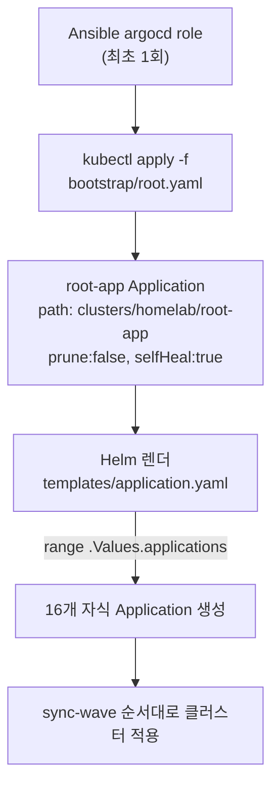
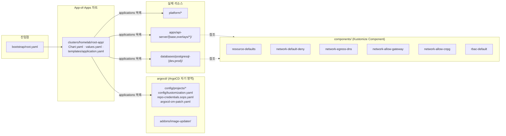
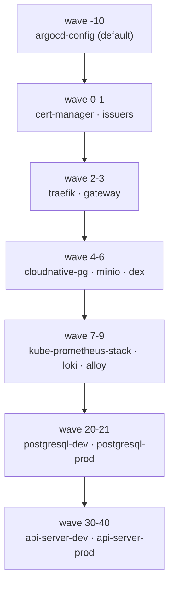
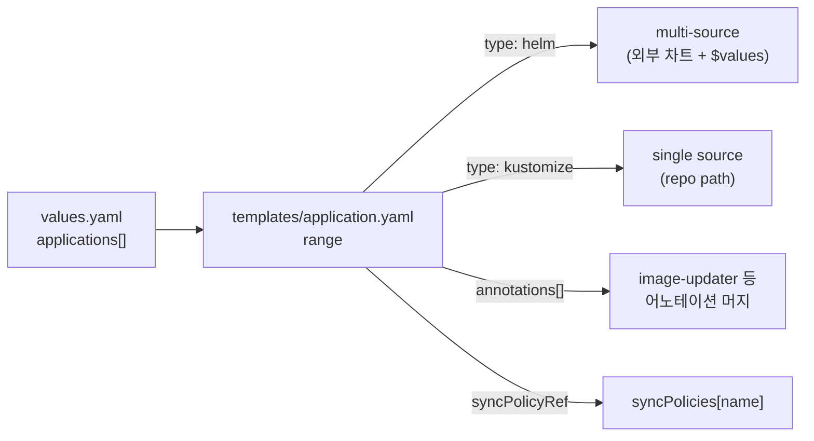
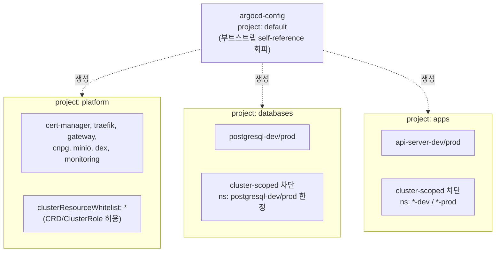
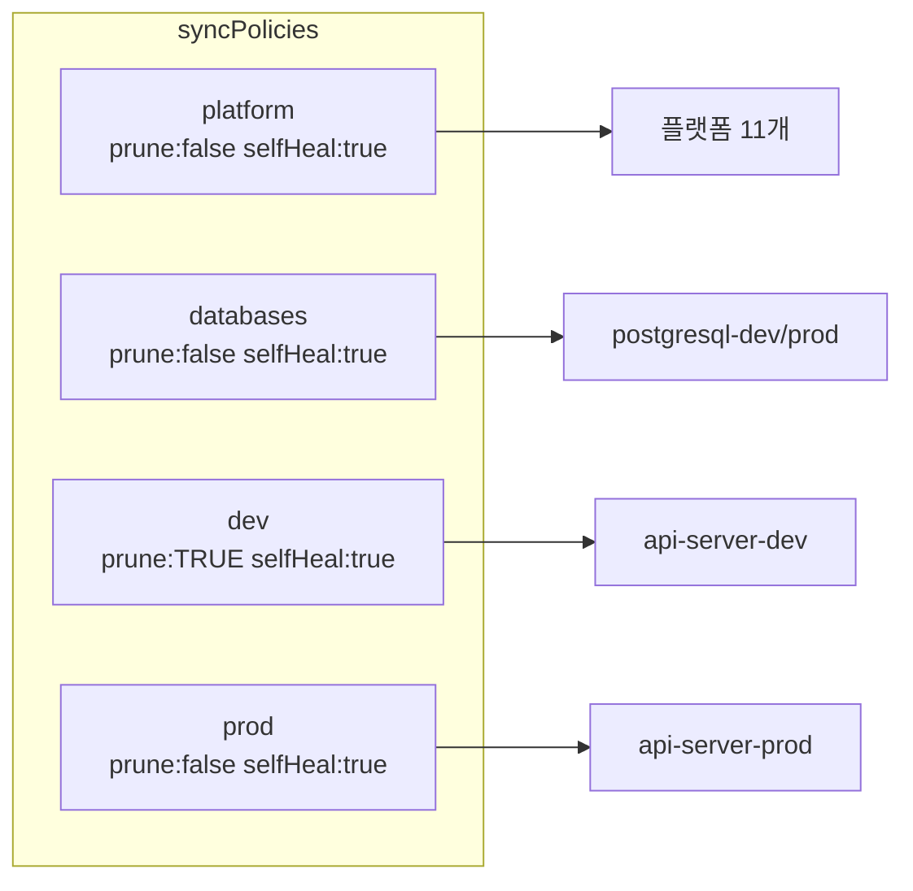
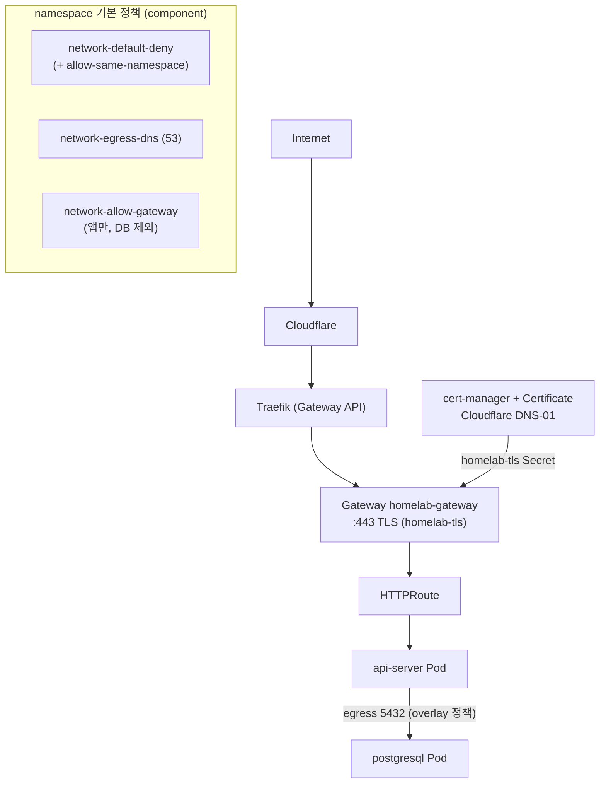
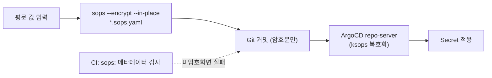
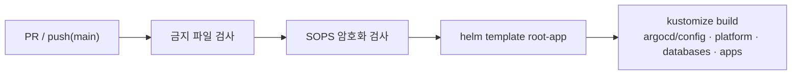

# GitOps 아키텍처 (리팩토링 후 현재 구조)

리팩토링(`claude-code-gitops-refactor-guide.md` 기준, Phase 1~10) 완료 후의 **현재 저장소
구조**를 정리한 문서입니다. 변경 검토용이며, 모든 내용은 `helm template` / `kustomize build`
로 렌더 검증된 상태를 반영합니다.

> 관련 문서: [`gitops-guide.md`](./gitops-guide.md)(동작 흐름), [`argocd-understanding.md`](./argocd-understanding.md)(개념/장단점), [`../gitops/README.md`](../gitops/README.md)(운영 상세)

---

## 1. 핵심 요약

| 항목 | 리팩토링 전 | 리팩토링 후 (현재) |
| --- | --- | --- |
| 부트스트랩 진입 | `bootstrap/` 에 root + app-of-apps 혼재 | **`bootstrap/root.yaml` 하나만** |
| App-of-Apps 위치 | `bootstrap/app-of-apps/` | `clusters/homelab/root-app/` |
| Application 정의 | `templates/{platform,databases,apps}/*.yaml` 다수 | **단일 `templates/application.yaml`** + `values.yaml`의 `applications` 목록 |
| 실제 리소스 | `manifests/{platform,databases,apps}/` | `platform/`, `databases/`, `apps/` (승격) |
| AppProject | `default` 위주 | **`platform` / `databases` / `apps`** 분리 |
| 보안 baseline | `components/security-baseline/` 단일 | 5개 작은 component 로 분리 |
| dev/prod 자동화 | 공통 | `syncPolicies` 로 차등 (prod 보수적) |
| CI | 없음 | `.github/workflows/gitops-validate.yaml` |

---

## 2. 진입 흐름 (부트스트랩 → 전체 발화)



- `bootstrap/` 에는 **`root.yaml` 하나만** 존재 (진입점 역할 명확화).
- `root-app` 은 보수적으로 `prune:false` (자식 Application 실수 삭제 방지).
- 서비스 추가/삭제는 `clusters/homelab/root-app/values.yaml` 의 `applications` 목록만 수정.

---

## 3. 디렉토리 구조



```text
gitops/
├── bootstrap/root.yaml                # 최초 1회 진입점 (이 파일만)
├── clusters/homelab/root-app/         # App-of-Apps Helm chart
│   ├── Chart.yaml
│   ├── values.yaml                    # global / hosts / syncPolicies / applications
│   └── templates/{_helpers.tpl, application.yaml}
├── argocd/
│   ├── config/{projects/*, argocd-cm-patch.yaml, repo-credentials.sops.yaml, kustomization.yaml}
│   └── addons/image-updater/{values.yaml}   # Application 은 root-app 목록이 생성(wave -5)
├── platform/{cert-manager, cert-manager-issuers, traefik, gateway,
│             cloudnative-pg, dex, minio, monitoring/*}
├── databases/{postgresql-dev, postgresql-prod}/
├── apps/api-server/{base, overlays/{dev,prod}}/
├── components/{resource-defaults, network-default-deny, network-egress-dns,
│               network-allow-gateway, network-allow-cnpg, rbac-default}/
└── docs/{architecture.md, adr/}
```

---

## 4. Application 목록 · Sync Wave · Project

`values.yaml` 의 `applications` 목록이 곧 아래 표입니다. 15개 Application 이 wave 순서대로 발화합니다.



| Wave | Application | type | project | syncPolicy |
| --- | --- | --- | --- | --- |
| -10 | argocd-config | kustomize | `default` | platform |
| -5 | argocd-image-updater | helm | platform | platform |
| 0 | cert-manager | helm | platform | platform |
| 1 | cert-manager-issuers | kustomize | platform | platform |
| 2 | traefik | helm | platform | platform |
| 3 | gateway | kustomize | platform | platform |
| 4 | cloudnative-pg | helm | platform | platform |
| 5 | minio | helm | platform | platform |
| 6 | dex | helm | platform | platform |
| 7 | kube-prometheus-stack | helm | platform | platform |
| 8 | loki | helm | platform | platform |
| 9 | alloy | helm | platform | platform |
| 20 | postgresql-dev | kustomize | databases | databases |
| 21 | postgresql-prod | kustomize | databases | databases |
| 30 | api-server-dev | kustomize | apps | **dev** |
| 40 | api-server-prod | kustomize | apps | **prod** |

> 차트 버전은 기존 저장소 값을 유지했습니다 (cert-manager v1.16.1, traefik 32.1.1,
> cloudnative-pg 0.22.1, minio 5.2.0, dex 0.19.1, kps 65.1.1, loki 6.16.0, alloy 0.10.0).

### 단일 템플릿 렌더 방식



---

## 5. AppProject 권한 경계



- **platform**: 플랫폼만 CRD/ClusterRole 등 클러스터 스코프 리소스 설치 허용.
- **databases / apps**: cluster-scoped 리소스 **차단** — 필요 시 platform 계층으로 분리.
- **argocd-config** 만 예외적으로 `default` — platform 프로젝트를 스스로 만드는 부트스트랩이라
  self-reference 데드락을 피하기 위함.

---

## 6. 동기화 정책 (dev/prod 차등)



| 정책 | prune | 대상 | 이미지 갱신 |
| --- | --- | --- | --- |
| platform / databases / prod | **false** (보수적) | 플랫폼, DB, prod 앱 | prod = **semver** |
| dev | true (적극 정리) | dev 앱 | dev = latest |

prod 는 자동 prune 을 끄고 이미지도 semver 만 추적해 보수적으로 운영합니다.

---

## 7. 런타임 트래픽 & 보안 (NetworkPolicy)



- 모든 앱/DB namespace 는 **default-deny ingress** 후 필요한 것만 component 로 허용.
- 앱 namespace: `resource-defaults`, `network-default-deny`, `network-egress-dns`,
  `network-allow-gateway`, `rbac-default` (+ DB egress 5432).
- DB namespace: `network-allow-gateway` **제외**(gateway 노출 안 함), 대신
  `network-allow-cnpg`(오퍼레이터 접근) + `allow-ingress-api-server-{env}`(앱→DB 5432 ingress) 추가.
- 앱→DB 연결은 **앱 egress + DB ingress 양쪽** 정책이 짝을 이뤄야 성립.

---

## 8. Secret / SOPS



- 모든 Secret 은 `*.sops.yaml` 로만, age 암호화 상태로 커밋. 평문 커밋 금지.
- 대상: `argocd/config/repo-credentials.sops.yaml`,
  `platform/cert-manager-issuers/cloudflare-token.sops.yaml`, `platform/dex/secret.sops.yaml`,
  `platform/minio/secret.sops.yaml`, `databases/postgresql-{dev,prod}/secret.sops.yaml`.
- ⚠️ **현재는 6개 모두 placeholder(미암호화)** — 실제 age 키로 암호화해야 CI 통과.

---

## 9. CI 검증 (`.github/workflows/gitops-validate.yaml`)

`gitops/**` 변경 시 실행, `working-directory: gitops`:



| 스텝 | 현재 로컬 결과 |
| --- | --- |
| 금지 파일 | ✅ |
| SOPS 암호화 | ⚠️ 6개 미암호화 (암호화 후 통과) |
| helm template (15 apps) | ✅ |
| kustomize build (7경로) | ✅ |

---

## 10. 검토 시 확인 포인트 & 남은 작업

**설계상 판단이 들어간 지점 (가이드와 다르게 처리):**
1. 차트 버전 — 기존 값 유지 (가이드 예시 상향 무시).
2. `argocd-config` project = `default` — 부트스트랩 self-reference 데드락 회피.
3. 템플릿에 `annotations` 맵 지원 추가 — image-updater 자동갱신 기능 보존.
4. `network-default-deny` 에 `allow-same-namespace` 동봉 — 기존 동작 유지.

**실제 사용 전 남은 작업 (환경/키 필요):**
- `*.sops.yaml` 6개 age 암호화 + `.sops.yaml` 의 age 공개키 교체.
- placeholder 치환: `REPO_URL`(GitHub owner), `homelab.example.com`(도메인).
- `git add -A` 후 커밋 (대량 파일 이동 포함).
