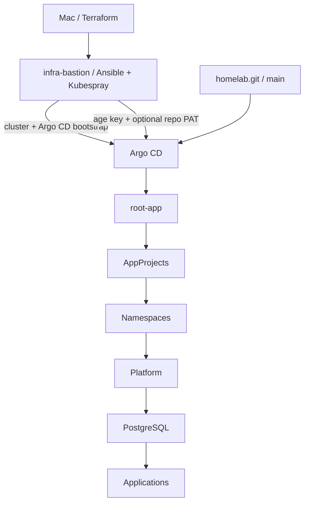
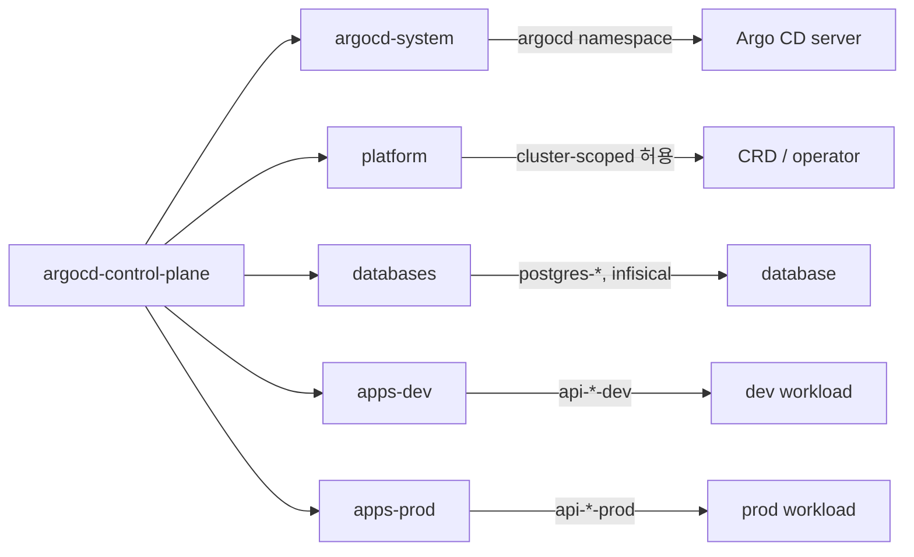
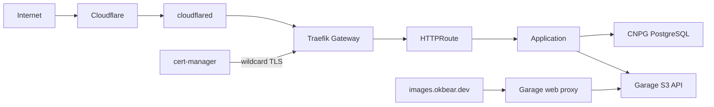
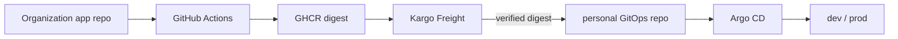

# GitOps 아키텍처

현재 체크아웃의 선언을 기준으로 제어 흐름, 소유권, 권한과 운영 한계를 정리한다.
`gitops/issues/`의 설계안과 주석 처리된 Application은 현재 배포 상태로 간주하지 않는다.

## 제어 흐름

```mermaid
flowchart TB
    TF["Mac / Terraform"] --> AN["infra-bastion / Ansible + Kubespray"]
    AN -->|"cluster + Argo CD bootstrap"| ARGO["Argo CD"]
    AN -->|"age key + optional repo PAT"| ARGO
    GIT["homelab.git / main"] --> ARGO --> ROOT["root-app"]
    ROOT --> PROJECTS["AppProjects"] --> NS["Namespaces"]
    NS --> PLATFORM["Platform"] --> DB["PostgreSQL"] --> APPS["Applications"]
```

Terraform은 VM과 네트워크, Ansible/Kubespray는 Kubernetes와 Argo CD 설치를 소유한다.
Ansible이 `bootstrap/root.yaml`을 적용한 뒤 root-app이
`clusters/homelab/root-app/values.yaml`에서 하위 Application을 생성하고 Argo CD가 Git의
desired state와 클러스터를 지속적으로 맞춘다.

## App-of-Apps와 sync wave

| Wave | Application | Project | 책임 |
| ---: | --- | --- | --- |
| -100 | `argocd-control-plane` | `default` | AppProject 생성 |
| -50 | `platform-namespaces` | `platform` | Namespace와 metadata |
| -45 | `platform-local-path-provisioner` | `platform` | local-path PV |
| -40 | `platform-gateway-api-crds` | `platform` | Gateway API CRD |
| -35 | `platform-cert-manager` | `platform` | certificate controller/CRD |
| -30 | `platform-cert-manager-config` | `platform` | DNS-01 Secret와 issuer |
| -25 | `platform-traefik` | `platform` | Gateway controller |
| -20 | `platform-traefik-gateway` | `platform` | shared Gateway/Certificate |
| -15 | `platform-cloudflared` | `platform` | external tunnel |
| -14 | `platform-cloudnative-pg` | `platform` | PostgreSQL operator |
| -13 | `platform-openbao` | `platform` | secret store server |
| -12 | `platform-external-secrets` | `platform` | secret sync controller |
| -11 | `platform-kargo` | `platform` | promotion controller/CRD |
| -10 | `platform-garage` | `platform` | S3-compatible storage |
| -10 | `argocd-server` | `argocd-system` | Argo CD 노출 리소스 |
| -9 | `platform-garage-route` | `platform` | public image route |
| 10 | `databases-postgres-{dev,prod}` | `databases` | CNPG Cluster |
| 30 | `apps-nginx-{dev,prod}`, `apps-api-common-dev` | `apps-*` | workload |

root-app은 21개의 활성 하위 Application을 선언한다. 같은 wave는 병렬일 수 있고 wave는
controller Ready를 보장하지 않는다. PostgreSQL 적용 전 CNPG CRD/controller readiness처럼
런타임 의존성을 별도로 확인해야 한다.

외부 Helm chart는 chart와 Git values를 결합한 multi-source Application이다. 현재 중앙
버전 매핑은 cert-manager `1.21.1`, Traefik app `3.6.15`/chart `39.0.9`, Kargo `1.11.0`이다.
CloudNativePG `0.29.0`, OpenBao `0.29.2`, External Secrets Operator `2.9.0`은 Application에
직접 고정되어 있다.

## 권한과 소유권

```mermaid
flowchart LR
    CP["argocd-control-plane"] --> P0["argocd-system"]
    CP --> P1["platform"]
    CP --> P2["databases"]
    CP --> P3["apps-dev"]
    CP --> P4["apps-prod"]
    P1 -->|"cluster-scoped 허용"| PLATFORM["CRD / operator"]
    P2 -->|"postgres-*, infisical"| DB["database"]
    P3 -->|"api-*-dev"| DEV["dev workload"]
    P4 -->|"api-*-prod"| PROD["prod workload"]
    P0 -->|"argocd namespace"| SERVER["Argo CD server"]
```

- `argocd-control-plane`은 아직 없는 project가 자신을 생성하는 self-reference를 피하려고
  `default` project를 쓰는 bootstrap 예외다.
- `platform`은 CRD, ClusterRole, Namespace 등 cluster-scoped 리소스를 허용한다.
- `databases`는 destination을 postgres-dev/prod와 infisical로 한정한다.
- `apps-dev`와 `apps-prod`는 namespace 패턴과 허용 kind가 분리되며 prod가 더 좁다.
- `argocd-system`은 argocd namespace 자원만 담당해 일반 platform 권한과 분리한다.

Namespace의 단일 owner는 `platform/namespaces` Helm chart다. root-app destination과
`CreateNamespace`는 Application 옵션일 뿐 Namespace label/metadata의 owner가 아니다.
Gateway 접근 label도 Namespace catalog에서 관리한다.

## 트래픽과 데이터

```mermaid
flowchart LR
    NET["Internet"] --> CF["Cloudflare"] --> TUN["cloudflared"]
    TUN --> GW["Traefik Gateway"] --> ROUTE["HTTPRoute"] --> APP["Application"]
    CM["cert-manager"] -->|"wildcard TLS"| GW
    APP --> PG["CNPG PostgreSQL"]
    APP --> GARAGE["Garage S3 API"]
    IMG["images.okbear.dev"] --> PROXY["Garage web proxy"] --> GARAGE
```

외부 트래픽은 Cloudflare Tunnel과 Traefik Gateway API를 거친다. cert-manager가 DNS-01
wildcard certificate를 제공한다. Garage의 S3/RPC/Admin endpoint는 내부에 두고 website
endpoint만 route로 공개한다.

Secret은 두 경로로 나뉜다. Ansible Vault가 Argo CD의 age key와 선택적 root repo PAT를
bootstrap하고, Git의 SOPS payload는 repo-server/KSOPS가 Kubernetes Secret으로 만든다.
OpenBao와 ESO는 설치되지만 현재 workload Secret을 ExternalSecret으로 이전한 상태는 아니다.
상세 절차는 [`gitops/SECRETS.md`](../gitops/SECRETS.md)에 있다.

## 이미지 승격 경계

```mermaid
flowchart LR
    ORG["Organization app repo"] --> CI["GitHub Actions"] --> GHCR["GHCR digest"]
    GHCR --> KARGO["Kargo Freight"] -->|"verified digest"| GITOPS["personal GitOps repo"]
    GITOPS --> ARGO["Argo CD"] --> ENV["dev / prod"]
```

애플리케이션 CI에 개인 GitOps repo write 권한을 직접 주지 않고 Kargo가 immutable
digest/Freight를 승격하는 경계를 목표로 한다. 현재는 Kargo controller 설치까지만 선언되어
있고 Stage/Warehouse/PromotionTask 파이프라인은 없다. 따라서 동일 digest의 dev→prod
승격은 아직 라이브 완료 상태가 아니다.

## 운영 한계

- 단일 control plane/worker는 노드 장애를 견디는 HA가 아니다.
- local-path PV 데이터는 Pod와 함께 다른 노드로 이동하지 않는다.
- Garage single-node는 분산 복제 내구성을 제공하지 않는다.
- OpenBao single Raft는 secret platform 설치와 HA가 별개임을 뜻한다.
- automated sync와 prune이 활성화되어 Git의 삭제도 자동 반영될 수 있다.

이 구조는 작은 homelab에서 소유권과 복구 경로를 명확히 하는 데 초점을 둔다. HA는 노드,
스토리지, control plane을 함께 확장해야 하며 replica 수만 늘려 해결되지 않는다.

## 검증 경계

| 구분 | 확인 | 의미 |
| --- | --- | --- |
| 정적 | Helm render, Kustomize build, YAML/Secret 검사 | 선언과 렌더 계약 |
| 라이브 | Application `Synced/Healthy`, Pod/webhook Ready, CRD discovery | controller 적용 |
| 서비스 | Certificate/HTTPRoute, DB readiness, 실제 HTTP/S3 요청 | end-to-end 동작 |

KSOPS는 plugin과 age key가 없는 로컬 환경에서 완전히 렌더할 수 없다. 또한 현재
`ghcr-secret-generator.sops.yaml`이라는 잘못 이름 붙은 비암호화 generator 때문에 CI의
SOPS filename 검사는 실패한다. 이 문서 갱신은 현재 파일 구조의 정적 대조 결과이며 cluster
상태와 실제 트래픽은 검증하지 않았다. 운영 절차는
[`gitops/README.md`](../gitops/README.md)를 참고한다.
