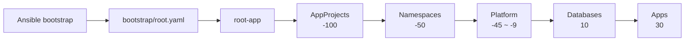

# GitOps

이 디렉터리는 Argo CD가 지속적으로 reconcile하는 클러스터 선언의 진입점이다. Terraform은
VM과 네트워크, Ansible/Kubespray는 Kubernetes와 Argo CD 부트스트랩, 이후의 플랫폼·DB·앱
리소스는 GitOps가 담당한다.

```text
Mac: Terraform  →  infra-bastion: Ansible/Kubespray  →  Kubernetes: Argo CD
```

Argo CD는 `https://github.com/hweyoung/homelab.git`의 `main`을 추적한다. `path`와
`valuesPath`는 저장소 루트 기준이다.

## 소유권 경계

| 영역 | 소유자 | 위치 |
| --- | --- | --- |
| VM, 네트워크 | Terraform | `terraform/` |
| Kubernetes, Argo CD, bootstrap Secret | Ansible/Kubespray | `ansible/` |
| Application 등록과 sync 순서 | root-app | `clusters/homelab/root-app/values.yaml` |
| AppProject 권한 | argocd-control-plane | `clusters/homelab/argocd-control-plane/` |
| Namespace와 공통 label | namespaces Application | `platform/namespaces/` |
| 실제 리소스 | 각 Application | `platform/`, `databases/`, `apps/` |

root-app의 destination이나 `CreateNamespace`는 Namespace metadata의 소유권을 대신하지
않는다. Namespace와 Gateway 접근 label은 `platform/namespaces/values.yaml`에서 관리한다.
Garage와 Kargo가 쓰는 `platform-existing-namespace` 정책도 이 선행 소유권에 의존한다.

## 구조와 활성 범위

```text
gitops/
├── bootstrap/root.yaml
├── clusters/homelab/
│   ├── root-app/                 # Application, 버전, policy, wave
│   ├── argocd-control-plane/     # AppProject
│   └── argocd-server/            # Argo CD 외부 노출
├── platform/                     # CRD, operator, ingress, secret, storage
├── databases/postgres/           # CNPG base/overlay
├── apps/                         # workload base/overlay
├── SECRETS.md
└── issues/                       # 설계 자료; 배포 소스가 아님
```

현재 활성 구성은 AppProject와 Namespace, local-path storage, Gateway API, cert-manager,
Traefik, Cloudflare Tunnel, CloudNativePG, OpenBao, External Secrets Operator, Garage, Kargo,
PostgreSQL dev/prod, test-nginx dev/prod, api-common dev다. Infisical과 OpenBao 외부 route는
디렉터리가 있지만 root-app 항목이 주석 처리되어 배포 대상이 아니다. 디렉터리 존재가 아니라
`applications`의 활성 항목을 기준으로 판단한다.

## 동기화 흐름



wave는 Application 적용 순서이지 이전 controller의 Ready를 보장하는 런타임 장벽은 아니다.
CNPG 같은 operator 의존성은 readiness를 별도로 확인한다.

root-app 템플릿은 `applications`를 순회한다. 외부 Helm chart는 chart와 Git values를
multi-source로 결합하고, Kustomize source는 내부 `path`를 렌더한다. `versionRef`는
`platformVersions.activeVersion`을 chart version으로 변환하고, `syncPolicyRef`는 공통
정책을 재사용한다. 현재 선언된 정책은 모두 automated sync와 prune이 활성화되어 있으므로
이름만 보고 prod가 수동 또는 prune 비활성이라고 가정하지 않는다.

## Application 변경 절차

1. 리소스를 책임에 따라 `platform/`, `databases/`, `apps/`에 둔다.
2. Namespace가 필요하면 `platform/namespaces/values.yaml`에 먼저 등록한다.
3. AppProject가 source repo, destination, resource kind를 허용하는지 확인한다.
4. root-app `applications`에 path/chart, project, namespace, wave, policy를 등록한다.
5. Helm/Kustomize와 Secret 검사를 통과시킨 뒤 push한다.

| 필드 | 의미 |
| --- | --- |
| `name`, `group` | Application 이름은 `[group-]name` |
| `project` | repo, namespace, resource 권한 경계 |
| `namespace` | destination; Namespace owner와는 별개 |
| `path` | 내부 Kustomize/directory source |
| `chart`, `chartRepo` | 외부 Helm source |
| `chartVersion`, `versionRef` | 고정 버전 또는 중앙 매핑 |
| `valuesPath` | 저장소 루트 기준 values |
| `wave`, `syncPolicyRef` | 적용 순서와 공통 sync 정책 |

## 부트스트랩과 검증

정상 설치에서는 `ansible/`의 `make argocd`가 Argo CD, SOPS key, 선택적 private-repo
credential과 root Application을 구성한다. 수동 적용은 복구나 진단에만 사용한다.

```bash
kubectl apply -f gitops/bootstrap/root.yaml

helm template root-app gitops/clusters/homelab/root-app
kustomize build gitops/clusters/homelab/argocd-control-plane
git diff --check
```

KSOPS generator가 있는 경로는 age key와 plugin이 필요하다. CI는
`.github/workflows/gitops-validate.yml`에서 chart/Kustomization 자동 탐색과 SOPS, 평문,
placeholder, 금지 파일 검사를 수행한다. 정적 성공은 배포 성공이 아니며 push 후에는 다음을
확인한다.

```bash
kubectl get applications -n argocd
kubectl get pods -A
kubectl get gateway,httproute -A
kubectl get cluster -A
```

모든 활성 Application의 `Synced/Healthy`, controller/webhook Ready, Certificate/HTTPRoute,
DB와 스토리지 상태까지 확인해야 라이브 검증이 끝난다.

장애 시에는 root-app의 Conditions, 로컬 Helm render, AppProject 권한, Namespace 선행 생성,
repo-server의 KSOPS/key mount 순으로 확인한다. root-app에는 resource finalizer가 있으므로
삭제하면 하위 Application과 리소스가 연쇄 삭제될 수 있다. 재동기화 수단으로 삭제하지 않는다.

Secret은 [SECRETS.md](SECRETS.md), 전체 구조는
[GitOps 아키텍처](../docs/gitops-architecture.md)를 참고한다.
