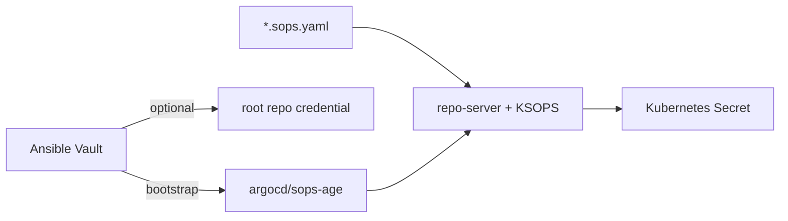

# Secret 운영

Secret은 두 계층으로 관리한다. Git에 선언 가능한 workload Secret은 SOPS+age로 암호화하고
Argo CD repo-server의 KSOPS가 복호화한다. Git을 읽기 전에 필요한 age private key와
private-repo credential은 Ansible이 out-of-band로 주입한다.



| 계층 | 예 | 값의 원본 | 적용 주체 |
| --- | --- | --- | --- |
| bootstrap | age private key, root repo PAT | `ansible/secrets.yml` | Ansible |
| GitOps workload | Cloudflare, DB, GHCR credential | `gitops/**/*.sops.yaml` | Argo CD + KSOPS |

root repo PAT를 GitOps에 두면 private repo를 읽기 위한 Secret을 그 repo에서 읽어야 하는 순환
의존성이 생긴다. 따라서 `sops-age`와 선택적 `argocd-repo-homelab`은 Ansible role이 먼저
만든다. public repo이면 PAT 주입은 생략한다.

OpenBao와 External Secrets Operator는 설치 대상이지만 현재 활성 workload credential은
SOPS/KSOPS 파일을 직접 소비한다. ExternalSecret 전환 시 같은 Secret 이름을 양쪽이 동시에
소유하지 않도록 명시적으로 ownership을 이전해야 한다.

## 현재 파일과 소비 경로

| 영역 | 암호화 payload | 소비자 |
| --- | --- | --- |
| cert-manager | `platform/cert-manager-config/cloudflare-api-token.sops.yaml` | DNS-01 issuer |
| Cloudflare Tunnel | `platform/cloudflared/cloudflare-tunnel-token.sops.yaml` | cloudflared |
| PostgreSQL | `databases/postgres/overlays/{dev,prod}/*.sops.yaml` | CNPG bootstrap/role |
| api-common | `databases/postgres/overlays/dev/api-common/db-auth-secret.sops.yaml` | DB role/app |
| api-common | `apps/api-common/base/ghcr-secret.sops.yaml` | imagePullSecret |
| Infisical 준비 | `platform/infisical/bootstrap/*.sops.yaml` 등 | 현재 root-app에서 비활성 |

KSOPS generator(`*-secret-generator.yaml`)에는 credential을 넣지 않고 `files:`에서 암호화
payload만 참조한다. 현재 `apps/api-common/base/ghcr-secret-generator.sops.yaml`은 암호문이
아닌 generator인데 잘못된 suffix를 사용한다. 실제 Kustomization은 suffix 없는 generator를
참조하지만 CI의 “모든 `*.sops.yaml` 암호화” 검사에는 걸린다. 이름을 정리하기 전에는 전체
Secret 검사를 실패로 판정하며, 이 파일을 payload로 오인해 암호화하거나 값을 넣지 않는다.

## 암호화와 편집

루트 `.sops.yaml`은 `gitops/**/*.sops.yaml`의 `data`와 `stringData`만 암호화한다. 현재
로컬 작업자와 Argo CD용 recipient를 함께 둔다. private key는 Git에 커밋하지 않는다.

```bash
sops -e -i gitops/path/to/name.sops.yaml
rg -n '^sops:|ENC\[' gitops/path/to/name.sops.yaml
git add gitops/path/to/name.sops.yaml gitops/path/to/name-secret-generator.yaml
```

수정은 `sops gitops/path/to/name.sops.yaml`로 한다. 샘플은 실제 값 없는
`*.example.yaml`로 두며 kubeconfig, `.env`, private key, `*.pem`, `*.key`는 커밋하지 않는다.

## bootstrap Secret 회전

```bash
cd ansible
ansible-vault edit secrets.yml
make sops
```

PAT는 새 값을 적용하고 repo 접근을 확인한 뒤 이전 값을 폐기한다. repository Secret은 Argo
CD가 API로 읽으므로 보통 repo-server 재시작이 필요 없다.

age key는 새 recipient 추가 → 모든 payload `sops updatekeys` → 양쪽 key 검증 → Ansible
Vault와 cluster key 교체 → repo-server restart → Application 확인 → 이전 recipient 제거
순서로 회전한다.

```bash
find gitops -name '*.sops.yaml' -type f -exec sops updatekeys -y {} \;
kubectl -n argocd rollout restart deployment/argocd-repo-server
```

현재 잘못 이름 붙은 generator도 `find` 결과에 포함되므로 먼저 payload 목록을 검토한다.
private key만 먼저 바꾸면 기존 Secret 전체를 복호화하지 못한다. repo-server는 key를
`subPath`로 mount하므로 key 변경 후 restart가 필요하다.

## 검증과 장애 진단

값을 출력하지 않는 정적 검사:

```bash
find gitops -name '*.sops.yaml' -type f -print | xargs grep -L '^sops:'
rg -l '^kind:[[:space:]]*Secret' gitops -g '*.yaml' -g '*.yml'
```

라이브 확인:

```bash
kubectl get secret -n argocd sops-age
kubectl logs -n argocd deployment/argocd-repo-server
kubectl get applications -n argocd
```

복호화 실패는 Application Conditions → repo-server의 `ksops`/`sops`/`age` 로그 → generator
경로 → recipient/private key 일치 → key 회전 후 restart 여부 순으로 본다. `sops -d`나
`kubectl get secret -o yaml` 결과를 로그·문서에 붙이지 않는다. key가 없는 환경의 KSOPS
검증은 `NOT VERIFIED`로 남긴다.
